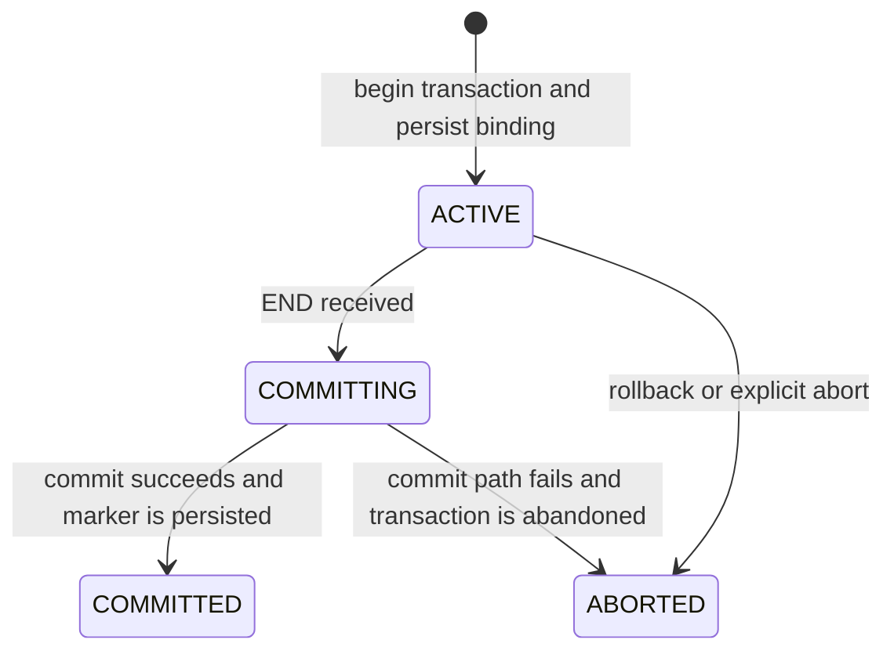

# Sink Failover and Recovery

This document describes the current failover and local recovery mechanism implemented in Pixels Sink.

## Scope

The current implementation is intentionally narrow.

Recovery is implemented for:

- `sink.datasource=storage`
- `sink.mode=retina`
- `sink.trans.mode=batch`

The primary write path covered by recovery is the `TableCrossTxWriter` path.

## Goals

The recovery design preserves the original mapping:

- `DataSourceTxId -> Pixels TransID`
- `DataSourceTxId -> Pixels TS`

After a sink restart, the same source transaction should continue to use the same Pixels transaction identity and timestamp, instead of allocating a new transaction.

The recovery design also needs a timestamp-based replay boundary so that sink recovery and Retina-side recovery can converge on the same replay window.

## Key Assumptions

- The storage source is replayable.
- The transaction server can restore the original transaction context with `getTransContext(pixelsTransId)`.
- The transaction server exposes a safe checkpoint boundary through `GetSafeGcTimestamp`.
- Recovery replay keeps the original Pixels timestamp.
- During recovery, `INSERT` can be rewritten to `UPDATE` with `before = after` so that replay is idempotent on the Retina side.

## Recovery Metadata

The sink stores recovery metadata in a local RocksDB database.

It keeps four kinds of state:

- transaction binding:
  `dataSourceTxId -> pixelsTransId, timestamp, lease, beginOffset, lastSafeOffset, state`
- active transaction order:
  `beginOffset + dataSourceTxId -> dataSourceTxId`
- commit marker:
  `dataSourceTxId -> committed`
- timestamp secondary index:
  `pixelsTs -> dataSourceTxId / pixelsTransId / sourceOffset`

The timestamp secondary index is required because the replay checkpoint is expressed in Pixels timestamp space, not only in source offset space.

## Startup Modes

Two startup modes are supported.

### `bootstrap`

`bootstrap` means:

- start from the beginning of the storage source
- do not continue unfinished recovery state

If recovery state already exists:

- startup fails by default
- or the operator can force cleanup with:
  `sink.recovery.bootstrap.force_overwrite=true`

### `recovery`

`recovery` means:

- load active recovery metadata from RocksDB
- query `GetSafeGcTimestamp` from `TransServer`
- use the local `pixelsTs` secondary index to seek the corresponding replay position
- rebuild the replay window from that checkpoint and from the earliest unfinished transaction state

## Recovery State Machine

The local recovery state uses four values:

- `ACTIVE`
- `COMMITTING`
- `COMMITTED`
- `ABORTED`




## Data Flow

The storage source now carries a physical replay offset through the main pipeline:

- `fileId`
- `byteOffset`
- `epoch`
- `recordType`

This offset is used for replay positioning. The runtime synthetic transaction id such as `txid_loopId` is still kept, but it is not the recovery source of truth.

The recovery path now depends on both:

- physical source offset, for local replay positioning
- Pixels timestamp, for checkpoint alignment with `TransServer` and Retina-side recovery

```mermaid
flowchart LR
    A[Storage files] --> B[Storage source]
    B --> C[StorageSourceRecord payload + offset]
    C --> D[Transaction provider]
    C --> E[Row provider]
    D --> F[RecoveryManager records BEGIN offset]
    E --> G[RowChangeEvent carries sourceOffset]
    G --> H[RetinaWriter / SinkContextManager]
    H --> I[TableCrossTxWriter flush]
    I --> J[update lastSafeOffset]
    H --> K[record pixelsTs secondary index]
    H --> L[TransactionProxy commit]
    L --> M[persist COMMITTED marker]

## Replay Segments

The recovery event stream should be treated as three logical segments.

### Segment 1: checkpoint-complete

This segment is fully replay-safe from the perspective of `TransServer`.

Boundary:

- determined by `GetSafeGcTimestamp`
- resolved to a source seek position through the local `pixelsTs` secondary index

Properties:

- if sink itself is recovering, this segment is normally before the local active replay window
- if a Retina instance crashes, it may still reset sink replay back into this segment
- rows in this segment may be re-read and re-sent, so replay must still be idempotent
- this segment is not "strictly skipped"; it is only the checkpoint-complete part of the stream

### Segment 2: active replay window

This segment contains transactions around the recovery boundary.

Properties:

- it includes both committed and uncommitted transactions
- row replay is required for both committed and uncommitted transactions
- committed transactions must not send commit again to `TransServer`
- uncommitted transactions must continue on the original `pixelsTransId / pixelsTs`

This is the main local recovery segment.

### Segment 3: unread tail

This segment has never been read by the current sink process.

Properties:

- it starts after the current replay/recovery boundary
- normal source consumption should keep advancing the unread-tail offset
- this segment is ordinary forward processing, not historical replay
```

## Write and Recovery Behavior

### BEGIN

When a source `BEGIN(dataSourceTxId)` is processed:

- the sink first checks whether a binding already exists
- if it exists, the sink restores the original Pixels transaction context
- otherwise, the sink allocates a new Pixels transaction and persists the binding immediately

### Row replay

Each row keeps the original source transaction id and the original Pixels timestamp.

During recovery:

- rows may be replayed from the checkpoint-complete segment if Retina-side recovery resets sink to an older boundary
- rows in the active replay window are replayed for both committed and uncommitted transactions
- `INSERT` may be rewritten to `UPDATE`
- `before` is copied from `after`

At the source-read level, committed and unfinished transactions can both be replayed again.
The difference is in commit handling:

- committed transactions still replay row writes, but must not commit again
- unfinished transactions replay row writes and continue on the original Pixels transaction context

This replay model, together with stable `Pixels TS` and optional `INSERT -> UPDATE` rewriting, is the main mechanism used to tolerate duplicate row replay.

### Flush safety

`lastSafeOffset` is advanced only after a `TableCrossTxWriter` flush or batch succeeds.

This means:

- `lastSafeOffset` is only a per-transaction flush marker
- it is not the main global replay checkpoint
- it is not required to be globally monotonic
- a crash may still replay some already-written rows
- replay correctness relies on idempotent semantics
- the sink does not assume that every processed row is immediately durable

### END and commit

When `END(dataSourceTxId)` arrives:

1. the local state changes to `COMMITTING`
2. the sink sends the commit to `TransServer`
3. after commit succeeds, the sink persists:
   - `state = COMMITTED`
   - commit marker
   - removal from the active transaction order index

If the sink crashes after commit succeeds but before the local marker is written, replay may still attempt the commit again. This is a known boundary and is one reason the commit marker is part of the durable recovery state.

## Replay Strategy

On recovery startup:

1. open RocksDB
2. query `GetSafeGcTimestamp` from `TransServer`
3. use the local `pixelsTs` secondary index to seek the replay checkpoint in the source stream
4. load unfinished transactions and find the earliest required replay window
5. rebuild the three logical segments:
   - checkpoint-complete
   - active replay window
   - unread tail
6. replay rows for committed and unfinished transactions in the active replay window
7. suppress duplicate commit for transactions that already have a commit marker
8. continue unfinished transactions using the original Pixels transaction context

## Known Limitations

- Recovery is currently scoped to `storage + retina + batch`.
- The implementation is centered on the `TableCrossTxWriter` path.
- `ABORTED` exists in the state model but is not yet a full recovery path.
- `pixelsTs -> replay position` secondary indexing is required for the final checkpoint-based design.
- `lastSafeOffset` is persisted, but it is not sufficient to define the global replay checkpoint by itself.
- `sink.recovery.fail_on_corruption` exists as a config key, but corruption handling is not fully wired yet.
- `sink.recovery.dir` is currently reserved; the active implementation mainly uses `sink.recovery.rocksdb.dir`.

## Recommended Operational Use

- Use `bootstrap` for fresh runs or intentional full replays.
- Use `recovery` only after an unclean shutdown that should continue existing transaction bindings.
- Do not enable `sink.recovery.bootstrap.force_overwrite` unless you explicitly want to discard previous unfinished recovery state.
- Keep the recovery RocksDB on stable local storage, not on temporary storage.
