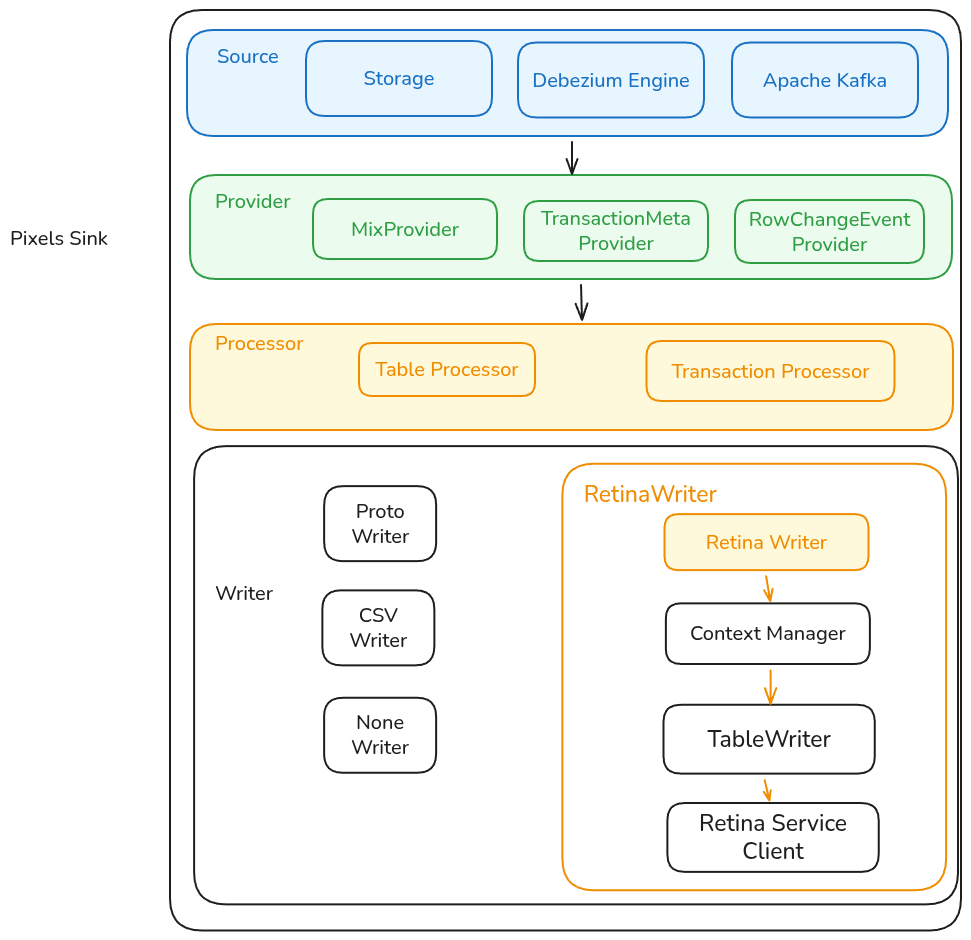
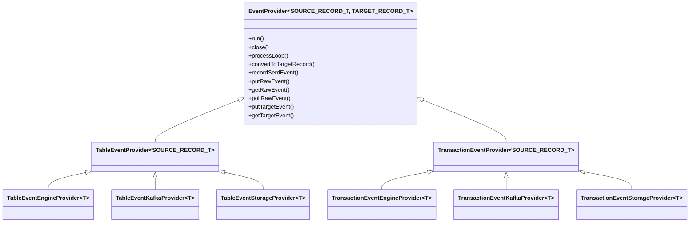
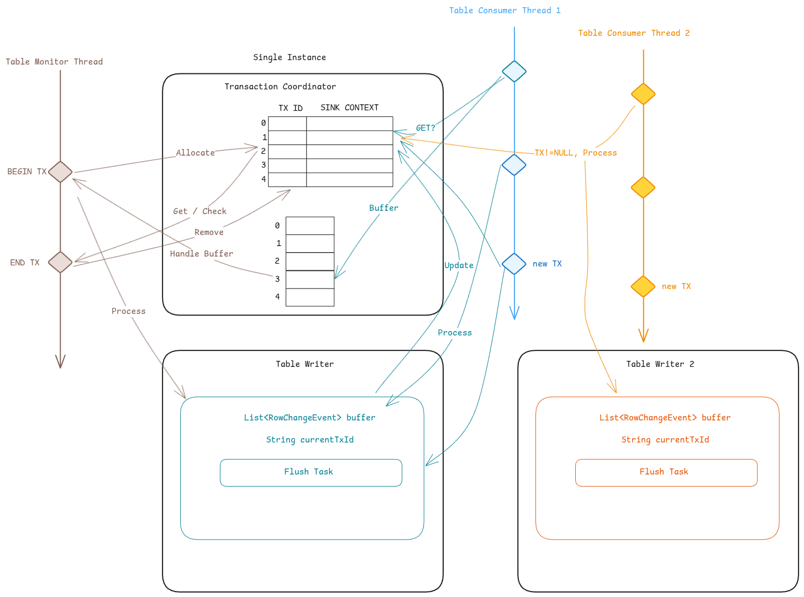

# Pixels Sink Overview

Pixels Sink uses a multi-stage pipeline. Each stage communicates via producer/consumer queues.

**Entry**

**PixelsSinkApp**
- Main entry point for running as a standalone server.
- Configuration is loaded via `PixelsSinkConfigFactory` using the properties file passed by `-c`.

**PixelsSinkProvider**
- Implements Pixels SPI so it can be started by Pixels Worker.
- Receives a `ConfigFactory` directly and builds the same sink pipeline.

**Source**
The source stage pulls events and forwards raw payloads to providers.

**Source Inputs**
| Source Type | Description | Related Config |
| --- | --- | --- |
| `engine` | Debezium Engine reads WAL/binlog directly from a database | `debezium.*` |
| `kafka` | Kafka consumer reads change events from topics | `bootstrap.servers`, `group.id`, `topic.*` |
| `storage` | Reads from Pixels storage files containing serialized sink proto records | `sink.proto.*`, `sink.storage.loop` |

**Source Outputs**
- The source does not parse events. It forwards raw records to providers.

**Provider**
Providers convert source records into Pixels events.

Example mappings:

| Provider | Source Type | Target Type |
| --- | --- | --- |
| `TableEventEngineProvider` | Debezium Struct | `RowChangeEvent` |
| `TableEventKafkaProvider` | Kafka topic | `RowChangeEvent` |
| `TableEventStorageProvider` | Proto bytes | `RowChangeEvent` |
| `TransactionEventEngineProvider` | Debezium Struct | `SinkProto.TransactionMetadata` |
| `TransactionEventKafkaProvider` | Kafka topic | `SinkProto.TransactionMetadata` |
| `TransactionEventStorageProvider` | Proto bytes | `SinkProto.TransactionMetadata` |

**Processor**
Processors pull events from providers and write to the sink writers.

- `TableProcessor` instances are created by `TableProviderAndProcessorPipelineManager`.
- There is typically one `TableProcessor` per table to maintain per-table ordering.
- `TransactionProcessor` is a singleton.

**Writer**
Writers implement `PixelsSinkWriter`:

| Method | Description |
| --- | --- |
| `writeRow(RowChangeEvent rowChangeEvent)` | Write a row change |
| `writeTrans(SinkProto.TransactionMetadata transactionMetadata)` | Handle transaction metadata |
| `flush()` | Flush buffered data |

**Retina Writer**
`RetinaWriter` implements transactional replay into Retina.

Key components:
- `RetinaServiceProxy` communicates with Retina.
- `SinkContextManager` holds transaction context and table writer proxies.

Bucket routing for `RowChangeEvent`:
- Insert: derive bucket from the after-image key.
- Delete: derive bucket from the before-image key.
- Update: if primary key is unchanged, use any key. If primary key changes, split into delete and insert events and preserve delete-then-insert order.

Table writers:
- `SingleTxWriter` writes a single transaction per call.
- `CrossTxWriter` allows a batch to contain multiple transactions.

Transactions are committed via `TransactionProxy` which supports synchronous or async batch commits.

**Proto Writer**
Creates storage source files by serializing events to proto. Metadata (file paths, etc.) is stored in ETCD.

**CSV Writer**
Writes events to CSV files.

**Flink Writer**
Exposes events to Flink through a polling service.
