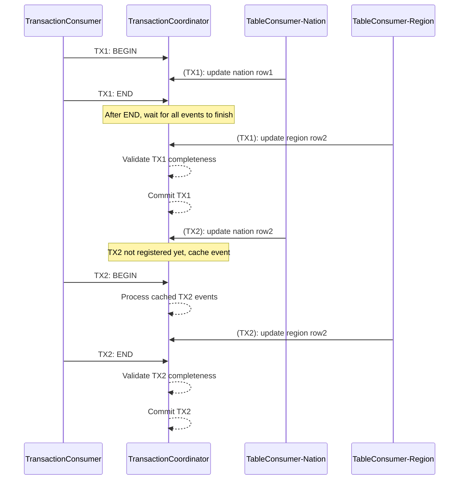

# Transaction Handling

Assume row records for the same table are read in transaction order.

```mermaid
sequenceDiagram
    participant TC as TransactionConsumer
    participant CO as TransactionCoordinator
    participant T1 as TableConsumer-Nation
    participant T2 as TableConsumer-Region
%% Transaction TX1 lifecycle
    TC ->> CO: TX1: BEGIN
    T1 ->> CO: (TX1): update nation row1
    TC ->> CO: TX1: END
    Note over CO: After END, wait for all events to finish
%% Delayed events for TX1
    T2 ->> CO: (TX1): update region row2
    CO -->> CO: Validate TX1 completeness
    CO -->> CO: Commit TX1
%% Transaction TX2 lifecycle (out-of-order arrival)
    T1 ->> CO: (TX2): update nation row2
    Note over CO: TX2 not registered yet, cache event
    TC ->> CO: TX2: BEGIN
    CO -->> CO: Process cached TX2 events
    T2 ->> CO: (TX2): update region row2
    TC ->> CO: TX2: END
    CO -->> CO: Validate TX2 completeness
    CO -->> CO: Commit TX2
```
